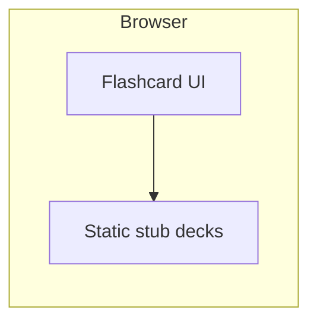

# PRD: Cursor Onboarding Memory Cards

**Canonical source (Notion):** https://www.notion.so/35dda74ef04580ef94f7d7d2341fee30

---

## Document control

| Field | Value |
| --- | --- |
| **Product** | Cursor Onboarding Memory Cards |
| **Document type** | Product Requirements Document |
| **Status** | Draft |
| **Version** | 1.0 |
| **Last updated** | 2026-05-11 |
| **Author** | Mats (via Cursor) |

---

## 1. Overview

### 1.1 Problem statement

New Cursor users absorb a lot of information during onboarding. Without spaced repetition or active recall, key concepts fade quickly.

### 1.2 Proposed solution

Build a **simple memory-card (flashcard) application** that helps internalize the ideas and facts from the **Cursor Onboarding** learning material. Users review short prompts and answers in a focused, low-friction flow.

### 1.3 Guiding principles

- **Keep the implementation minimal** — one clear screen flow, few dependencies, easy to ship and maintain.
- **No external APIs** — all runtime behavior works offline in the browser (or local static host) without calling third-party services.
- **Stubbed content** — card decks ship as **local static data** (e.g. JSON or TypeScript constants). Anything that would normally come from an API is represented by **placeholder or hand-authored stub data** until a future phase explicitly adds integrations.
- **Public by default** — source code and (if applicable) the deployed demo are **public** (open repository and public URL or static hosting), so others can learn from or fork the project.

---

## 2. Goals and success criteria

### 2.1 Goals

1. Increase **retention** of core onboarding topics through **active recall**.
2. Deliver an **MVP** that can be built and run without backend infrastructure.
3. Make the project **easy to share** publicly.

### 2.2 Success metrics (MVP)

| Metric | Target |
| --- | --- |
| Time to first successful local run | Under 5 minutes for a developer cloning the repo |
| Core loop completeness | User can complete a full deck session without errors |
| Dependency surface | No runtime network calls to external APIs |
| Visibility | Repository (and optional demo) are publicly accessible |

### 2.3 Non-goals (MVP)

- User accounts, sync across devices, or cloud saves.
- Fetching onboarding content from Notion, Cursor, or other live sources.
- Analytics pipelines, A/B testing, or paid tiers.

---

## 3. Target audience

- **Primary:** You (and similar learners) finishing or revisiting **Cursor Onboarding** who want a quick daily review habit.
- **Secondary:** Other developers looking for a **small public example** of a flashcard UI with static data.

---

## 4. User stories

1. As a learner, I want to **see a deck** of cards derived from onboarding themes so I know what I am practicing.
2. As a learner, I want to **flip a card** to reveal the answer so I can check my recall.
3. As a learner, I want to **move to the next card** so I can progress through the deck.
4. As a learner, I want **basic progress feedback** (e.g. position in deck, or simple score) so I feel a sense of completion.
5. As a developer, I want **stub data in the repo** so I can run the app with no API keys or backends.

---

## 5. Functional requirements

| ID | Requirement | Priority |
| --- | --- | --- |
| F-1 | Display a **question** and **answer** for each memory card. | P0 |
| F-2 | Support **flip** or equivalent toggle between front and back. | P0 |
| F-3 | Support **next / previous** navigation within a deck (or a single “next” flow through a shuffled or ordered deck). | P0 |
| F-4 | Load card content from **in-repo static structures** (no network fetch for content in MVP). | P0 |
| F-5 | Include at least one **stub deck** labeled as aligned with “Cursor Onboarding” topics (placeholders acceptable where real copy is not yet curated). | P0 |
| F-6 | Optional: **shuffle** or **filter by tag** if it stays simple. | P1 |

---

## 6. Non-functional requirements

- **Simplicity:** Prefer a single-page app or minimal framework footprint; avoid unnecessary services.
- **No external APIs:** No client calls to third-party HTTP APIs for MVP (including analytics SDKs that phone home, unless explicitly deferred — default is **none**).
- **Performance:** Instant interactions on modern desktop and mobile browsers for deck sizes on the order of tens to low hundreds of cards.
- **Accessibility (lightweight):** Keyboard-usable navigation where feasible; sufficient color contrast for text.
- **Public project:** License and README state that the project is **public**; deployment instructions allow a **public static host** (e.g. GitHub Pages, Netlify, Vercel static export) without secrets.

---

## 7. Data model (stubbed)

All data is **local**. Example shape (illustrative):

```typescript
// Stub only — adjust to chosen stack
type MemoryCard = {
  id: string;
  front: string;  // prompt
  back: string;   // answer
  tags?: string[]; // e.g. ["shortcuts", "agents", "rules"]
};

type Deck = {
  id: string;
  title: string;
  description?: string;
  cards: MemoryCard[];
};
```

- **Curated onboarding copy** can replace stub strings over time without changing architecture.
- Any future “sync from Notion” feature is **out of scope** for this PRD’s MVP.

---

## 8. High-level architecture

- **Client-only UI** reads stub **deck** data bundled at build time or imported as static modules.
- **No server component** required for MVP.
- **Optional:** `localStorage` for last position or preferences — still no external APIs.



---

## 9. Milestones

1. **M0 — Scaffold:** Public repo, README, runs locally.
2. **M1 — Core loop:** Flip + next through stub deck.
3. **M2 — Polish:** Progress indicator, basic styling, keyboard shortcuts.
4. **M3 — Public demo:** One-click or documented deploy to a public static URL.

---

## 10. Risks and mitigations

| Risk | Mitigation |
| --- | --- |
| Scope creep (features that need APIs) | Lock MVP to static data; track future integrations separately |
| Thin or placeholder content | Iterate on card copy after UI exists; keep tags for organization |

---

## 11. Open questions

- Exact **stack** (plain HTML/JS vs. small React/Vite app, etc.).
- Whether to add **spaced repetition** logic later or keep pure manual review for v1.
- Preferred **public host** for the demo.

---

## 12. Appendix: Original idea (preserved)

> my idea is to make an application using “memory cards” to help me internalize the information in my Cursor Onboarding learning document.
